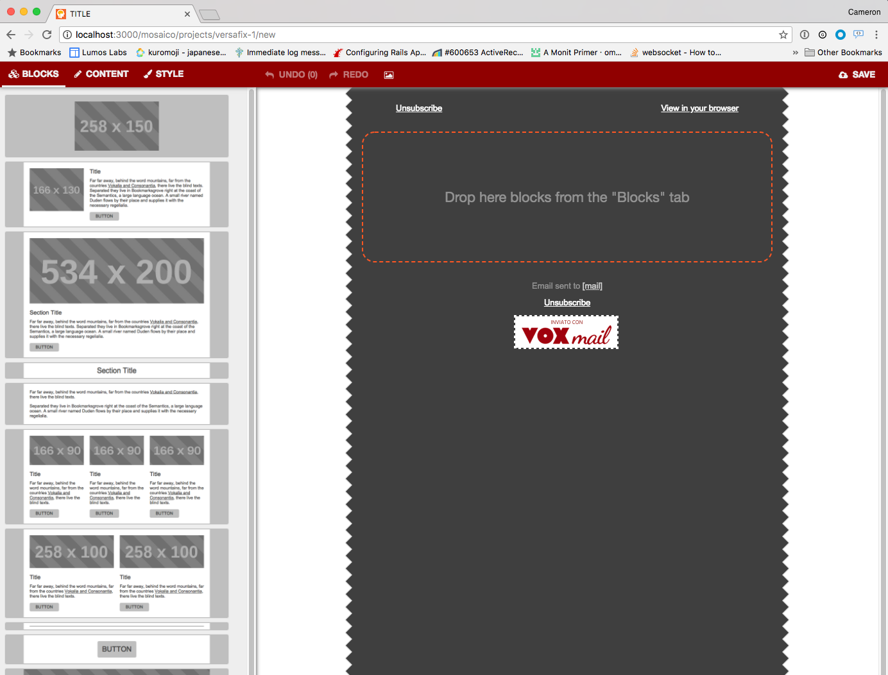

## mosaico-rails

[Mosaico](https://github.com/voidlabs/mosaico) is a Javascript-based email editor written by Void Labs. This project is an attempt to put it on Rails.

Good-looking, responsive emails are hard to write because of the multitude of email clients out in the wild today. Mosaico helps by providing a templating language and several ready-made templates to make crafting emails easier. If you're in the market for an email editor but aren't sure if Mosaico is right for you, consider [taking it for a spin](https://mosaico.io/) before you read any further. The rest of this README describes how to integrate it into your existing Ruby on Rails application.

### Getting Started

mosaico-rails is distributed as a rubygem. You'll need to add it to your Gemfile and run `bundle install` to get started. In your Gemfile, add:

```ruby
gem 'mosaico', '~> 2.0'
```

In order to enable image manipulation, you'll need to install [imagemagick](https://www.imagemagick.org/script/index.php) or [graphicsmagick](http://www.graphicsmagick.org/). Both should be available via your package manager of choice. For example on MacOS, run `brew install imagemagick` or `brew install graphicsmagick`.

Mosaico integrates with your Rails app by providing a Rails _engine_. You can read more about engines [here](http://guides.rubyonrails.org/engines.html). Adding Mosaico to your Gemfile should be enough to make its engine available to your application, but you'll need to tell Rails how to route requests to it. In engine parlance, this is referred to as "mounting." Open up config/routes.rb and mount the mosaico engine at the desired URL:

```ruby
mount Mosaico::Engine => '/mosaico'
```

Next, run `bundle exec rake routes`. You should see a bunch of new Mosaico routes. For the most part you won't have to worry about what all these do. This step is more of a sanity check to make sure mounting the engine worked.

```
 Prefix Verb URI Pattern Controller#Action
mosaico      /mosaico    Mosaico::Engine

Routes for Mosaico::Engine:
     projects POST   /projects(.:format)                    mosaico/projects#create
      project GET    /projects/:id(.:format)                mosaico/projects#show
              PATCH  /projects/:id(.:format)                mosaico/projects#update
              PUT    /projects/:id(.:format)                mosaico/projects#update
              GET    /projects/:template_name/new(.:format) mosaico/projects#new
     template GET    /templates/:template_name(.:format)    mosaico/templates#show
mosaico_image GET    /images(/:id)(.:format)                mosaico/images#show
              POST   /images(.:format)                      mosaico/images#create
              DELETE /images/:id(.:format)                  mosaico/images#destroy
```

Next, you'll need to run Mosaico's database migrations. Unlike other projects, Mosaico's migrations are stored inside the gem itself and are automatically made available to your application. Run `rails db:migrate` (or `rake db:migrate` if you're using an older version of Rails).

Now we're ready to run the app and see Mosaico in action. Start your rails server (usually `rails server` or `rails s`) and point your browser to [http://localhost:3000/mosaico/projects/versafix-1/new](http://localhost:3000/mosaico/projects/versafix-1/new). You should see the Mosaico editor loaded up with the prepackaged versafix-1 template:



You should be able to drag blocks from the list on the left into the center composition area, upload images, and save your project. Take note of all the configuration options Mosaico makes available under the "Content" and "Style" tabs.

Getting up and running is really only the first step. You'll probably want to configure Mosaico to actually send email in a production environment. See the remaining sections for guidance.

### Upgrading from version 1 to version 2

We've introduced a new default image backend since v2.0.0. If you are upgrading from v1, you will have to add the following code in order to keep your current image backend, i.e. to avoid broken images. Create an initializer in config/initializers/mosaico.rb and add these lines:

```ruby
Mosaico::Engine.config.placeholder_backend = Mosaico::LocalPlaceholderBackend.new
Mosaico::Engine.config.image_backend = Mosaico::LocalImageBackend.new
```

### Custom Image Backends
Uploading images within a Mosaico template is easy - just drag and drop from your filesystem onto any image placeholder. Behind the scenes, Mosaico is resizing and storing the images in the configured storage backend. The default storage backend is just your application's ActiveStorage service. Images are stored with mosaico/images/ and mosaico/placeholders/ as path prefix or key prefix. ActiveStorage comes with support for local storage as well as thrid-party service like Amazon's S3 or Google Cloud Storage. You may want to customize how images are to be uploaded and stored. Creating a storage backend is easy though - you just have to implement several methods. For example, here's the skeleton for an custom S3 backend:

```ruby
module Mosaico
  class S3Backend
    attr_reader :bucket
  
    # you'll need to know which bucket to keep the files in
    def initialize(bucket)
      @bucket = bucket
    end
  
    # Stores the file indicated by the "source" parameter
    # and names it using the "as" parameter. For example,
    # to store a file at /path/to/cat.png as cat.png, the
    # store method would be called with
    # ("/path/to/cat.png", as: "cat.png")
    def store(source, as:)
      # @TODO: upload to S3
    end

    # Downloads the file from S3 and returns its local
    # file name. Consider using Ruby's Tempfile class to
    # store the temporary file.
    def retrieve(file)
      # @TODO: download from S3 and store in temporary file;
      #   return temporary file path
    end

    # Returns the URL to the file. S3 URLs look something like
    # http://#{bucket}.s3.amazonaws.com/cat.png
    def url_to(file)
      # @TODO: return the S3 URL to the given file
    end
  end
end
```

Once the backend base class is finished, you'll need to create several classes for storing images (that you upload) and placeholders (that Mosaico automatically generates).

```ruby
module Mosaico
  class S3ImageBackend < S3Backend
    def initialize
      super('my-image-bucket')
    end
  end
  
  class S3PlaceholderBackend < S3Backend
    def initialize
      super('my-placeholder-bucket')
    end
  end
end
```

Next, configure Mosaico to use these backends. Create an initializer in config/initializers/mosaico.rb and add these lines:

```ruby
Mosaico::Engine.config.placeholder_backend = Mosaico::S3PlaceholderBackend.new
Mosaico::Engine.config.image_backend = Mosaico::S3ImageBackend.new
```

### Custom Templates

Although Mosaico comes with several predefined templates ("versafix-1", "tedc15", and "tutorial"), it also supports custom templates. Unfortunately Void Labs' [documentation for their template language](https://github.com/voidlabs/mosaico/wiki/Template-language) is pretty sparse. You'll probably have to experiment with a lot of trial and error to get it to do what you want. If you do decide to create your own template, adding it to the list of available templates is pretty straightforward.

1. Create a directory somewhere in your app for the template to live. For the purposes of this example, let's create a new template called "kosmo" and put it in our app's lib/ directory (specifically lib/templates/kosmo).
2. Create an HTML file with the same name as the template and prefixed with "template-", i.e. lib/templates/kosmo/template-kosmo.html.
3. Write your template by following the [documentation](https://github.com/voidlabs/mosaico/wiki/Template-language).
4. Any images you want to make available to your template should go in lib/templates/kosmo/img (nested directories are ok too). In your HTML, reference these images using relative paths. In other words, cat.png should be referenced as "img/cat.png".

Finally, register your template in your mosaico initializer (config/initializers/mosaico.rb):

```ruby
Mosaico.register_template('kosmo', Rails.root.join('lib/templates/kosmo'))
```

You should now be able to visit http://localhost:3000/mosaico/projects/kosmo/new and use your template to create a new email project.

### (Re)generating Thumbnails

All the blocks on the left-hand side of the Mosaico editor are programmatically generated thumbnails. The thumbnails are generated by a Javascript script that uses [PhantomJS](https://github.com/ariya/phantomjs) to render a template and take screenshots of its various blocks. The mosaico-rails project features a handy rake task that invokes the script and (re)generates the thumbnails.

Before running the rake task, you'll need to have several additional software packages installed:

1. [PhantomJS](https://github.com/ariya/phantomjs)
2. [nodejs](https://nodejs.org/)
3. [npm](https://www.npmjs.com/)

For the most part, these should be available via your operating system's package manager. On MacOS via [Homebrew](https://brew.sh/) for instance, you would run something like `brew install phantomjs nodejs npm`.

The thumbnailer rake task requires that your app already be running, so open up a new terminal window and start it up using `rails s`. In a separate terminal window, run `bundle exec rake mosaico:make_thumbs['template name here']`. By default, the rake task will try to communicate with an app running on localhost:3000. To point it to a different host and/or port, use the `APP_HOST` and `APP_PORT` environment variables. For example:

```
APP_PORT=3001 bundle exec rake mosaico:make_thumbs['template name here']
```

The rake task will generate thumbnails for each of the blocks and place them in your template's edres folder. Continuing with the example from the previous section, the kosmo template's thumbnails would be stored in lib/templates/kosmo/edres.

### Sending Email

Unfortunately actually _sending_ email is not supported yet (I would welcome a pull request). It should be relatively straightforward to hook into [ActionMailer](http://guides.rubyonrails.org/action_mailer_basics.html).

### Working with the Data Model

This project, i.e. mosaico-rails, is a pretty barebones project centered around integrating the Mosaico editor into your Rails application. Aside from the editor itself, no other UI elements have been added. For example, there is currently no UI for listing projects. Fortunately, Mosaico's data is backed by ActiveRecord models and works the way you'd expect it to. For example, to render a list of all available projects, you might do this in a controller:

```ruby
@projects = Mosaico::Project.all
```

and this in the corresponding view:

```erb
<% @projects.each do |project| %>
  <a href="<%= Mosaico.project_path(project) %>"><%= "#{project.template_name}-#{project.id}" %></a>
<% end %>
```

The only other model is `Mosaico::Image` which is polymorphic on `Mosaico::UploadedImage` and `Mosaico::PlaceholderImage`.

### License

Licensed under the GPLv3 license.

### Authors

1.  This gem: Cameron Dutro [@camertron](http://twitter.com/camertron)
2.  mosaico: Void Labs, it's [on github](https://github.com/voidlabs/mosaico)
